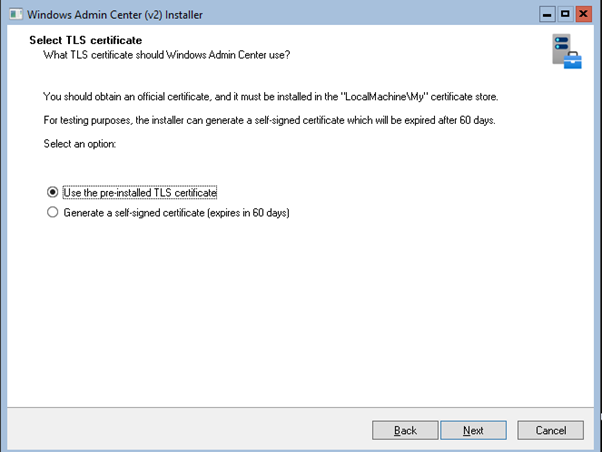
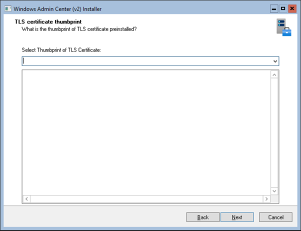
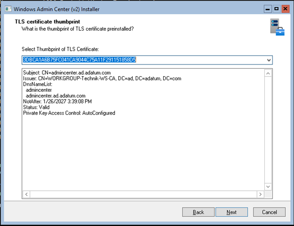

# Practice: Install Windows Admin Center using a script

## Required VMs

* VN1-SRV1
* VN1-SRV2
* VN1-SRV4

## Task

On VN1-SRV4, to install Windows Admin Center, run **C:\LabResources\Install-AdminCenter.ps1**.

## Instructions

Perform these steps on VN1-SRV4.

1. Logon as **ad\Administrator**.
1. In SConfig, enter **15** and press ENTER to exit to the command line.
1. At the command prompt run

    ````powershell
    C:\LabResources\Solutions\Install-AdminCenter.ps1
    ````

:exclamation:Attention: This script does not work anymore. To be able to proceed with the next practices and labs, do the following.

Perform these steps after the script finished.

1. Change the directory

    ````powershell
    cd C:\LabResources
    ````

1. Rename the downloaded file

    ````powershell
    Rename-Item .\WindowsAdminCenter.msi -NewName WindowsAdminCenter.exe
    ````

1. Execute the file

    ````powershell
    .\WindowsAdminCenter.exe
    ````

1. In *Windows Admin Center (v2) Installer* perform a **Custom setup.**
1. For the pages *Network access*, *Login Authentication* and *Port numbers* accept the default values and click **Next**.
1. In *Select TLS certificate* page, select the option *Use the pre-installed TLS certificate* if it is not already done.

1. In the next window, *TLS certificate thumbprint*, open the list and select the available certificate and click **Next**.


1. In the *Fully Qualified Domain Name* page, replace the FQDN by: **admincenter.ad.adatum.com** and click **Next**.

1. For all remaining pages, accept the default values and click **Next** or **Install**.
3. After the installation, deselect the only option in the last page and click **Finish**.

[Back to Overview](../WinGLA.md)
